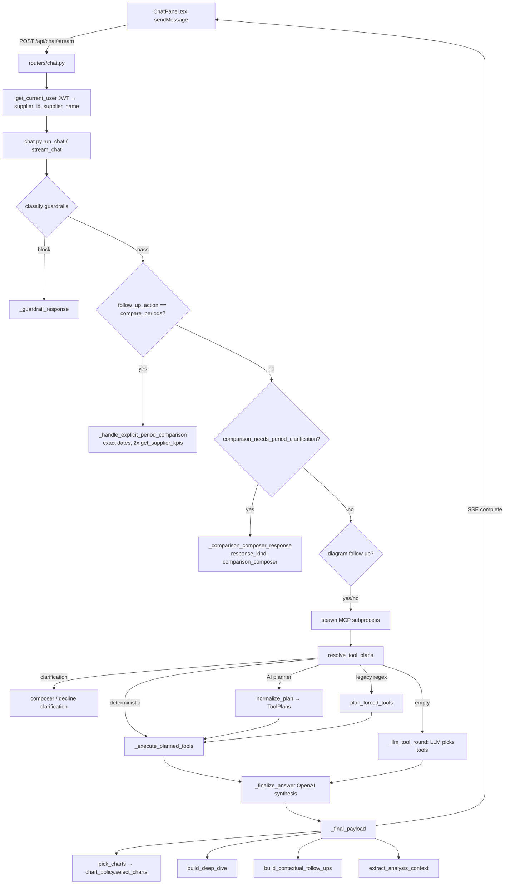

# Analytics Orchestration — Architecture Audit & Migration Plan

> Phase 0 deliverable for the AI-native analytics orchestration upgrade.
> Status: **audit complete; canonical schemas + full explicit-comparison vertical slice
> (planner → validator → executor → verifier → responder → chart) landed behind
> `AI_ORCHESTRATED_ANALYTICS_ENABLED` (default off).**
> Legacy behavior is unchanged when the flag is off.

## Implemented so far (`backend/app/analytics/`)

| Module | Role |
|---|---|
| `schemas.py` | Canonical `DateRange`, `ComparisonSpec`, `AnalysisPlan`, `AnalysisResult`, `VerificationResult`, `ConversationAnalysisContext` |
| `flags.py` | `AI_ORCHESTRATED_ANALYTICS_ENABLED`, `ANALYTICS_DEBUG_TRACE`, `ANALYTICS_SHADOW_EVAL` |
| `planner.py` | Deterministic Swedish comparison parser (month/rolling/YoY/ISO/composer) → canonical plan, or composer-clarification, or defer |
| `validator.py` | Deterministic validation (two periods, data bounds, chart/intent compat) → clarification |
| `registry.py` | Capability registry; `MIGRATED_CAPABILITIES = {period_comparison}` |
| `executor.py` | Maps validated plan → `get_supplier_kpis` ×2 (exact dates) → `AnalysisResult`; injectable async runner |
| `verifier.py` | Deterministic period/metric/chart/scope match; blocks mismatches |
| `responder.py` | Exact-range Swedish copy from verified result |
| `chart_builder.py` | `comparison_bar` payload from result with plan-identity fields |
| `orchestrator.py` | Wires stages + observability trace; returns answer / composer / defer |

Wired into `chat.py` `run_chat`/`stream_chat` behind the flag, ahead of the legacy
comparison branches. Closes audit risk **R3** (free-text month comparison now parsed to exact ranges).

---

## 1. Current request flow (frontend → final response)

**Entry points**
- `backend/app/routers/chat.py` — `POST /api/chat` (`run_chat`), `POST /api/chat/stream` (`stream_chat`, SSE). Both inject `supplier_id`/`supplier_name` from the JWT session — **never from the request body**.
- Frontend always uses the streaming endpoint (`frontend/src/api/client.ts::chatStream`). The non-stream `api.chat` is unused.

**Pipeline stages (`backend/app/services/chat.py`)**
1. Guardrails — `classify()` (regex, no LLM).
2. Explicit comparison — `follow_up_action.action == "compare_periods"` → `_handle_explicit_period_comparison` (L608).
3. Prior context parse — `prior_context_from_dict` → `PriorTurnContext`.
4. Comparison clarification — `comparison_needs_period_clarification(message, prior)` → composer.
5. Diagram follow-up handling.
6. MCP subprocess spawn + tool list filtered to `ALLOWED_TOOLS`.
7. `resolve_tool_plans` (deterministic → AI planner → legacy regex → empty).
8. Tool execution or `_llm_tool_round`.
9. Secondary `plan_forced_tools` fallback if zero tools ran.
10. `_finalize_answer` (OpenAI synthesis with retry).
11. `_final_payload` (sanitize, charts, deep dive, follow-ups, context).

---

## 2. Planner / intent router / regex inventory

| Layer | File | Role |
|---|---|---|
| Deterministic follow-ups | `intent_router.py` (`plan_deterministic_tools` via `tool_planner.py`) | Structured follow-up actions, NL context, period/region modifiers — bypass AI planner |
| AI planner | `planner_service.py::call_planner` | OpenAI structured output (`response_format` json_schema, `strict: true`), schema = `AnalysisPlan` |
| Plan normalization/validation | `plan_normalizer.py::normalize_plan` | Period resolution, region/category whitelist, comparison-chart guard, decline clarification, allowlist check, tool building, confidence threshold `0.45` |
| Legacy regex routing | `intent_router.py::plan_forced_tools` | Regex intent branches → `ToolPlan`s |
| LLM free tool choice | `chat.py::_llm_tool_round` | Fallback when planners return empty |

**Feature flag today:** `USE_AI_PLANNER` (default `true`). When false, AI planner skipped → legacy regex / LLM tools.

**Comparison-safety policy (recently added):** `comparison_labels.py` distinguishes trend / rolling change / explicit comparison; ambiguous comparisons open the composer; `message_has_explicit_comparison_pair` gates explicit routing.

---

## 3. OpenAI planner calls & fallback behavior

- `call_planner` — model `OPENAI_MODEL` (default `gpt-4o`), `temperature=0.0`, strict JSON schema from `AnalysisPlan.model_json_schema()`, validated via `AnalysisPlan.model_validate`. **No `supplier_id` in planner I/O.**
- Fallback chain in `resolve_tool_plans`: planner exception/low-confidence/unsupported intent/disallowed tool/empty plans → `plan_forced_tools`. Synthesis itself (`_finalize_answer`) is a separate OpenAI call with a retry on planning-phrase leakage.

---

## 4. MCP tools & query helpers

`mcp_server/server.py` registers 7 tools; all validate `supplier_id` as UUID and filter SQL via the `brands → products` join.

| Tool | Comparison/period model |
|---|---|
| `get_supplier_kpis` | Auto prior-period in payload. **YoY** when range is Jan 1–date same year (`prior_year_same_period`); else equal-length prior window. |
| `get_sales_over_time` | No built-in comparison. |
| `get_top_products` | No comparison; optional region filter; `limit` 1–50. |
| `get_sales_by_region` | No comparison. |
| `get_market_share` | Prior via `_prior_period_bounds` (YoY for YTD, else equal-length). Competitor data aggregate-only. |
| `get_declining_products` | **Rolling `days*2`** anchored to UTC today; `days` capped **365**. Never YoY. |
| `get_revenue_drivers` | Same **`days*2` rolling** model; `days` capped 365. |

**Default date range** (`_date_range`): both dates omitted + DB → full supplier history; without DB → 180-day lookback.

---

## 5. Chart selection & generation

- `chart_policy.py::resolve_chart_intent` chooses a `ChartIntent` from explicit `_chart_intent` hints → tool presence + question regex → `_explicit_period_comparison` gate.
- `chart_policy.py::select_charts` maps intent → builder in `chart_builder.py`.
- `chart_builder.py` payload shape: `chart_type`, `title`, `description`, `x_key`, `y_key`, `data[]`, `source_tool`, plus optional `chart_variant`, `layout`, `period_note`, `decline_metrics`, `highlights`, etc.
- **Charts are built directly from raw tool results + the user question** — not from a canonical plan/result object.

---

## 6. Period parsing/resolution/labeling

- `period_utils.py::resolve_period_range` supports: full history, previous year, current year (YTD), `senaste N dag`, `senaste veck`, `senaste kvartalet`, `senaste 90/180`, `senaste 12 mån`, `senaste året`.
- **Not parsed:** explicit month names (`mars 2026`), month-vs-month (`april mot maj`), free-text explicit date ranges (only via planner `exact_range` when the LLM emits `start_date`/`end_date`).
- `period_labels.py` builds answer phrases, chart subtitles, and synthesis blocks; `apply_period_labels` attaches `_period_kind` and label fields to tool results.

---

## 7. Prior chat context storage & reuse

- Frontend `buildPriorContext` (ChatPanel) sends the **last** assistant turn with tools (or awaiting-decline), paired with its user question, as `prior_context`.
- Backend `PriorTurnContext` (`intent_router.py`) + `follow_up_context.py::analysis_context_from_prior_data` reconstruct an `AnalysisContext` (intent, dates, period_kind, region, category, limit).
- Reuse rules already restrict comparison follow-ups to single-period prior turns (`comparison_labels.prior_has_reusable_period`).

---

## 8. Supplier/tenant scope (defense-in-depth)

1. JWT session → `supplier_id` (router; not from body).
2. `chat.py` strips `supplier_id` from LLM-visible tool schemas and force-injects it at MCP call (`_inject_supplier_scope`).
3. Planner/normalizer never read `supplier_id`.
4. MCP server validates UUID; SQL filters by `supplier_id`.
5. Guardrails detect supplier-tamper phrasing.
- Tenant theme/colors live frontend-only (`theme/tenantBranding.ts`): Coca-Cola red, Pepsi blue, Orkla orange, Estrella violet.

---

## 9. Existing test coverage (stdlib `unittest`, no pytest/DB)

| Topic | Files |
|---|---|
| Comparison | `test_comparison_labels.py`, `test_comparison_period.py`, `test_ytd_kpi_comparison.py` |
| Sales trend | spread across `test_intent_router.py`, `test_chart_policy.py`, `test_chart_builder.py`, `test_period_utils.py` |
| Ranking | `test_ranking_limits.py` |
| Decline | `test_decline_period.py` |
| Chart policy/builder | `test_chart_policy.py`, `test_chart_builder.py` |
| Period parsing | `test_period_utils.py`, `test_period_labels.py` |
| Planner/router | `test_intent_router.py`, `test_tool_planner.py`, `test_plan_normalizer.py`, `test_analysis_plan.py`, `test_follow_up_context.py`, `test_standalone_vs_followup.py` |
| Tenant scope | partial (`supplier_id` absence in plan args); **no adversarial cross-tenant test** |

- Run: `cd backend && python3 -m unittest discover -s tests` (or `PYTHONPATH=. ... -p 'test_*.py'`).
- OpenAI bypassed via `USE_AI_PLANNER` + `injected_plan`. DB mocked only in `test_overview_all_time_range.py`.

---

## Risks found

| # | Risk | Evidence | Severity |
|---|---|---|---|
| R1 | **No canonical result** — text, KPI, chart, drivers, metadata derive independently from raw tool results + question. Scope/period drift is possible. | `_final_payload` builds charts/deep-dive/context separately | **High** |
| R2 | **No verification stage** — nothing checks that chart periods == text periods == plan periods before render. | No verifier in pipeline | **High** |
| R3 | **Free-text explicit month comparison not parsed** (`mars 2026 mot april 2026`). Today it should clarify (composer), but any path that reaches `get_revenue_drivers`/decline silently uses a `days*2` rolling window. | `resolve_period_range` lacks month parsing; rolling tools cap at 365 | **High** |
| R4 | **`lägst omsättning` has no ascending-ranking capability** — risks routing to decline. | `query_top_products` has no sort param; no ascending intent | Medium |
| R5 | **`sedan start` after decline clarification** can fall through to generic overview. | `plan_awaiting_decline_period` / `message_specifies_period` gaps | Medium |
| R6 | **Two comparison entry points** (early `run_chat` + inside `resolve_tool_plans`) — divergence risk. | `chat.py` L734 + L774 | Medium |
| R7 | **No structured observability** (request_id/plan_id trace across stages). | logging is ad-hoc | Medium |
| R8 | **No adversarial tenant-isolation test.** | test audit §7 | Medium |
| R9 | Chart payload lacks plan identity (`analysis_plan_id`, periods) → frontend cannot reject mismatches. | `ChartPayload` types | Medium |

---

## Components to PRESERVE (working, reused by new orchestrator)

- MCP tools + `query_helpers` (tenant-safe SQL). New executor maps to these.
- `_handle_explicit_period_comparison` — already exact-date, no rolling fallback. Becomes the executor for `period_comparison`.
- In-chat comparison composer (frontend + `compare_periods` action) — the safe fallback per Phase 9.
- `period_utils` / `period_labels` — reused for resolution & labels.
- Guardrails, tenant scope injection, currency/format sanitizers.
- Existing `unittest` suite — kept green as regression guard.

## Components to DEPRECATE GRADUALLY (behind flag)

- Direct chart selection from raw tool results (`pick_charts` from question) → move to chart-from-`AnalysisResult`.
- Regex-first `plan_forced_tools` → demoted to deterministic safety fallback only.
- Independent context reconstruction → consolidated into `ConversationAnalysisContext`.
- Duplicate comparison clarification branches → single canonical decision in the planner+validator.

---

## Migration approach (incremental, behind `AI_ORCHESTRATED_ANALYTICS_ENABLED`)

1. **Phase 1 (done):** Canonical schemas in additive `backend/app/analytics/` module. No wiring yet. Zero behavior change.
2. **Phase 2–3:** Planning agent (wraps existing `call_planner`, emits canonical `AnalysisPlan2`) + deterministic validator. Behind flag; legacy path remains default.
3. **Phase 4:** Capability registry + executor mapping validated plans → typed MCP inputs; explicit comparison + composer migrate first (lowest risk, already exact-date).
4. **Phase 5:** Verification agent (period/metric/scope/chart match) with max 1 replan.
5. **Phase 6–7:** Response generator + chart-from-`AnalysisResult` with plan identity fields.
6. **Phase 8–9:** `ConversationAnalysisContext` + composer integration as the canonical clarification fallback.
7. **Phase 10–12:** Observability trace, parallel-evaluation mode, full test matrix, flag flip.

**Hard rule across all phases:** an explicit/custom period pair set in the plan must be byte-identical in result, chart payload, and answer text. No later stage may substitute a rolling/365 window.

---

## Feature-flag behavior (target)

| Flag | Default | Effect |
|---|---|---|
| `AI_ORCHESTRATED_ANALYTICS_ENABLED` | `false` (until migration complete) | When true: new orchestrator primary, legacy = controlled fallback for supported cases only. When false: current behavior (rollback safe). |
| `USE_AI_PLANNER` | `true` | Existing planner toggle; retained during migration. |
| `ANALYTICS_DEBUG_TRACE` | `false` | Dev-only: expose resolved intent, exact periods, capability, validation/verifier status in `analysis_meta`. |

---

## Recommended next implementation phase

**Phase 2–3** behind `AI_ORCHESTRATED_ANALYTICS_ENABLED`: build the planning agent (adapter over the existing `call_planner`) that emits the canonical `AnalysisPlan` from `analytics/schemas.py`, plus the deterministic validator that converts incomplete comparisons into composer responses — starting with the **explicit period comparison** capability since `_handle_explicit_period_comparison` already enforces exact dates.
